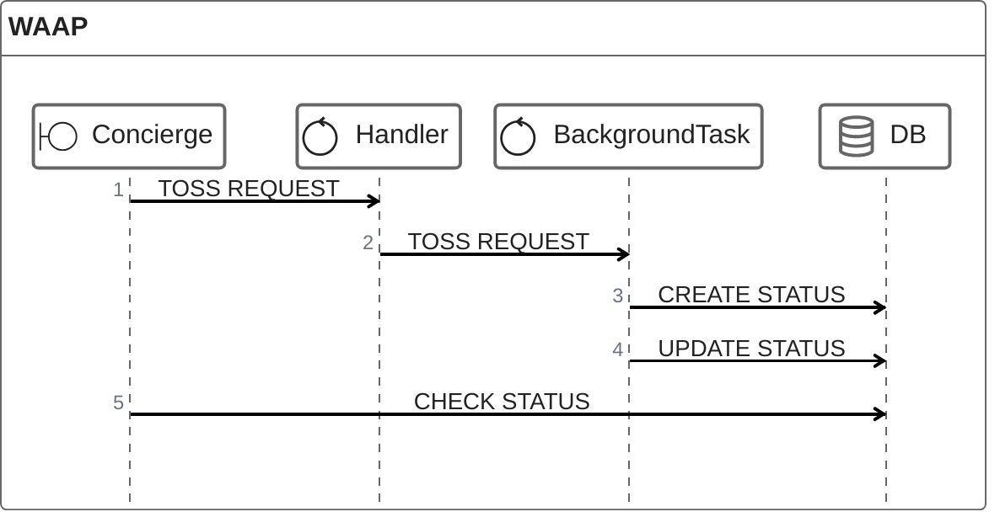
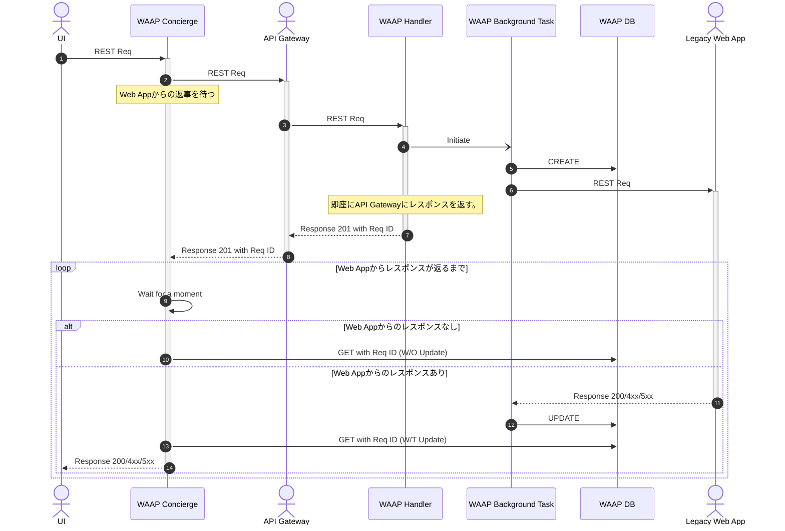

# WAAP
Web Application API Proxy

## 概要
WAAPはターンアラウンドタイムに対してルーズなレガシーWeb Applicationの前で稼働させることで、モダンなクラウドインフラで稼働するAPI Gateway等の制約を回避するProxyサービスです。
クラウドアプリケーションはその可用性や自立性を担保するためにターンアラウンドタイムを短く設計・実装されます。その一方でレガシーWebアプリケーションはその限りではありません。そのためレガシーWebアプリケーションの前にAPI Gateway等をおいてしまうと、タイムアウト（HTTP Status Code: 504）となってしまうことがしばしばです。
WAAPはこの問題を解決するために開発されました。

## 解決する課題
クラウドインフラのタイムアウト要件に合わないレガシーWebアプリケーションを、前段に配置されるAPI Gatewayをラッピングする形でタイムアウトを回避します。

## 構成


### 正常系シーケンス図


## Quick Start

### Download

```Shell
# gh repo clone Universal-Micro-Networks/waap
```
### Run
```Shell
# docker-compose up
```

## テスト方法
Docker Compose起動後
```Shell
# pytest 
```

## その他Tips

### Bump upについて
Bump upは、プラグインを入れると以下コマンドで一括アップデートできるのでおすすめです。
```
# poetry up --latest
```
https://github.com/MousaZeidBaker/poetry-plugin-up
