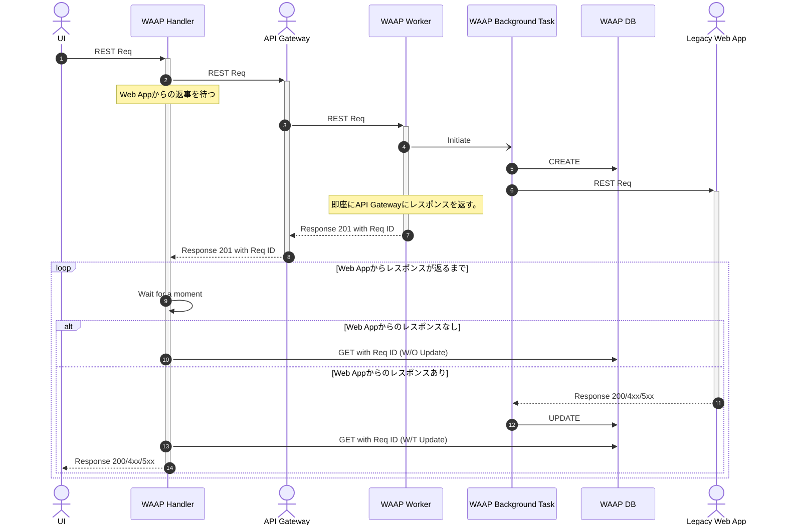

# WAAP
Web Application API Proxy

## 概要
WAAPはターンアラウンドタイムに対してルーズなレガシーWeb Applicationの前で稼働させることで、モダンなクラウドインフラで稼働するAPI Gateway等の制約を回避するProxyサービスです。
クラウドアプリケーションはその可用性や自立性を担保するためにターンアラウンドタイムを短く設計・実装されます。その一方でレガシーWebアプリケーションはその限りではありません。そのためレガシーWebアプリケーションの前にAPI Gateway等をおいてしまうと、タイムアウト（HTTP Status Code: 504）となってしまうことがしばしばです。
WAAPはこの問題を解決するために開発されました。

## 解決する課題
クラウドインフラのタイムアウト要件に合わないレガシーWebアプリケーションを、前段に配置されるAPI Gatewayをラッピングする形でタイムアウトを回避します。

## 構成
WAAPは二つのプロセス（HandlerとWorker＆BackgroundTask）と一つのDBによって構成されます。

|No.|Sub No.|Name|Role|
|---:|---:|---|---|
|1.|-|Worker|Receives an API request from UI and toss it to API Gateway|
|2.|1.|Handler|Receives an API request from the API Gateway and spaun background tasks|
|2.|2.|Background Task|manages slow requests/responses with a legacy web application|
|3.|-|DB|record request statuses of the requests to the legacy web applications|
### Worker & Handler

Fast API Application

### DB

Key Value Database
Now we assume it should be DynamoDB and we will add more DBs in the future.

### 正常系シーケンス図


## Quick Start

### Download

```Shell
# gh repo clone Universal-Micro-Networks/waap
```
### Run

.env ファイルを以下の環境変数例と[環境変数の一覧](#環境変数の一覧)を元に作成

### 環境変数の一覧

| 変数名                 | 説明                             |               |
|---------------------|--------------------------------|---------------|
| WORKER_URI          | Workerのバックグラウンドタスク起動エンドポイント | Handler内で利用   |
| WORKER_CHECK_URI    | WorkerのCheck用エンドポイント        | Handler内で利用   |
| MINIO_URI           | MinioのURI                      | Worker内で利用    |
| MINIO_ROOT_USER     | Minioルートユーザー                   | Worker内で利用 |
| MINIO_ROOT_PASSWORD | Minioルートパスワード                  | Worker内で利用 |
| BUCKET_NAME         | Minioのバケット名                    | Worker内で利用 |
| BUCKET_FILE_NAME    | Minioのバケットファイル名                | Worker内で利用 |
| MINIO_PORT          | Minioのポート番号                    | Worker内で利用 |
| DYNAMODB_URI        | DynamoDBのURI                   | Worker内で利用 |

.env ファイルを作成

### Webアプリケーションエンドポイント情報の設定ファイル
WORKERがアクセスするWebアプリケーションのエンドポイント情報をJSONファイルに記述し
Minioにアップロードする。そのファイル名を.envファイルのBUCKET_FILE_NAMEに記述
Handlerにアクセスする際のserver_idはこのJSONファイルに記述されたserver_idを指定する<br>

例
```json
{
      "server_id1": "https://www.dummy.com/",
      "server_id2": "http://127.0.0.1:8083/",
      "server_id3": "http://0.0.0.0:8038/",
      "server_id4": "http://waap-mmock-1:8083/"
}
```


```Shell
以下のコマンドで開発環境を構築

```Shell
# docker-compose up
```

## テスト方法
Docker Compose起動</br>
pytest.iniファイルの値を適宜設定
```Shell
# pytest
```

## その他Tips

### Bump upについて
Bump upは、プラグインを入れると以下コマンドで一括アップデートできるのでおすすめです。
```
# poetry up --latest
```
https://github.com/MousaZeidBaker/poetry-plugin-up


