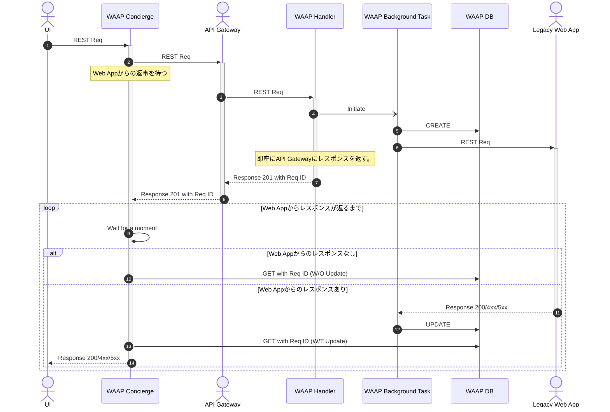

# WAAP
Web Application API Proxy

## 概要
WAAPはターンアラウンドタイムに対してルーズなレガシーWeb Applicationの前で稼働させることで、モダンなクラウドインフラで稼働するAPI Gateway等の制約を回避するProxyサービスです。
クラウドアプリケーションはその可用性や自立性を担保するためにターンアラウンドタイムを短く設計・実装されます。その一方でレガシーWebアプリケーションはその限りではありません。そのためレガシーWebアプリケーションの前にAPI Gateway等をおいてしまうと、タイムアウト（HTTP Status Code: 504）となってしまうことがしばしばです。
WAAPはこの問題を解決するために開発されました。

## 解決する課題
クラウドインフラのタイムアウト要件に合わないレガシーWebアプリケーションを、前段に配置されるAPI Gatewayをラッピングする形でタイムアウトを回避します。

## 構成
WAAPは二つのプロセス（ConciergeとHandler＆BackgroundTask）と一つのDBによって構成されます。

|No.|Sub No.|Name|Role|
|---:|---:|---|---|
|1.|-|Concierge|Receives an API request from UI and toss it to API Gateway|
|2.|1.|Handler|Receives an API request from the API Gateway and spaun background tasks|
|2.|2.|Background Task|manages slow requests/responses with a legacy web application|
|3.|-|DB|record request statuses of the requests to the legacy web applications|
### Concierge & Handler

Fast API Application

### DB

Key Value Database
Now we assume it should be DynamoDB and we will add more DBs in the future.

### 正常系シーケンス図


## Quick Start

### Download

```Shell
# gh repo clone Universal-Micro-Networks/waap
```
### Run

.env ファイルを以下の環境変数例と[環境変数の一覧](#環境変数の一覧)を元に作成

### 環境変数の一覧

| 変数名                  | 説明                 |               |
|----------------------|--------------------|---------------|
| CONCIERGE_URI        | ConciergeのURI      | Handler内で利用   |
| CONCIERGE_CHECK_URI  | ConciergeのCheckURI | Handler内で利用   |
| MINIO_URI            | MinioのURI          | Concierge内で利用 |
| MINIO_ACCESS_KEY     | Minioのアクセスキー       | Concierge内で利用 |
| MINIO_SECRET_KEY     | Minioのシークレットキー     | Concierge内で利用 |
| MINIO_BUCKET_NAME    | Minioのバケット名        | Concierge内で利用 |
| MINIO_PORT           | Minioのポート番号        | Concierge内で利用 |
| DYNAMODB_URI        | DynamoDBのURI       | Concierge内で利用 |
| DYNAMODB_URI_TEST    | テスト用DynamoDBのURI   | conftest内で利用  |

.env ファイルを作成後、以下のコマンドで開発環境を構築

```Shell
# docker-compose up
```

## テスト方法
Docker Compose起動後
```Shell
# pytest
```

## その他Tips

### Bump upについて
Bump upは、プラグインを入れると以下コマンドで一括アップデートできるのでおすすめです。
```
# poetry up --latest
```
https://github.com/MousaZeidBaker/poetry-plugin-up


